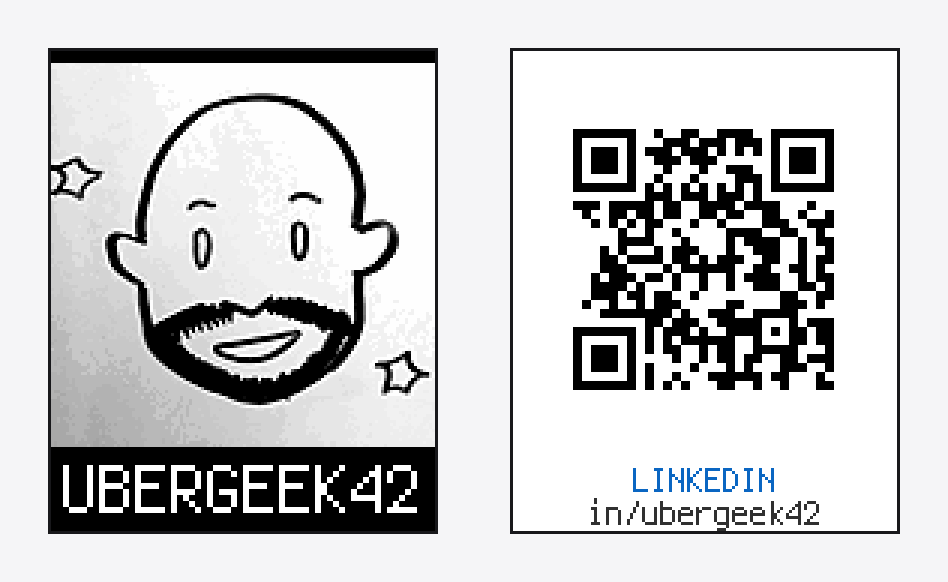

# ProfileCard — a three-sided badge for the CCC 2026 board

My [Carolina Code Conference 2026](https://blog.carolina.codes/p/2026-circuit-board-badge) badge runs as a digital business card. SW1 or SW2 steps through the sides — my photo with my handle underneath, a QR to my LinkedIn, and a QR to this repo — and SW3 kills the NeoPixels, which are the biggest draw on the board, when I want the CR123A to last. Every side is a pre-rendered 128×128 BMP in `img/`, built into a display group once at boot, so switching is instant and the badge carries no QR library. The code lives in [`samples/ProfileCard/code.py`](samples/ProfileCard/code.py) — copy it over the top-level `code.py` on the `CIRCUITPY` drive and CircuitPython auto-reloads.

A second experiment is in progress: [`samples/BadgeRadar/`](samples/BadgeRadar/) plots other badges around you over ESP-NOW, using signal strength as a stand-in for distance since the board has no accelerometer. Its shared radio layer is [`lib/badgenet.py`](lib/badgenet.py). ESP-NOW has no loopback — a lone badge hears nothing, not even itself — so the sample ships a SIM mode that invents neighbours, which is what makes it developable with one badge on a desk. `samples/BadgeRadar/README.md` also records the ESP-NOW behaviours confirmed on this hardware, several of which the docs get wrong.

**Want one of your own?** Easiest is the [web flasher](web/) — open it in Chrome or Edge, type your GitHub username, plug the badge in and pick the `CIRCUITPY` drive. It builds the photo, the QR codes and the whole payload in your browser and writes them to the badge; nothing is uploaded anywhere, and there is nothing to install. Firefox and Safari can't hand a page a directory, so they get a .zip to unpack onto the drive instead.

Or from a terminal: plug a badge in and run `python3 flash.py --github YOURNAME --linkedin in/yourname`. It pulls your GitHub avatar, builds the QR codes, converts everything to the 128×128 8-bit indexed BMPs the badge can load, and copies them across with the code — five files on a stock badge, since the libraries it needs are already there. Your details land in `badge_profile.py` on the badge, so editing them later is one file and a save. The only prerequisite is ImageMagick (`brew install imagemagick`), which decodes the avatar; everything else is the Python standard library.

To do it by hand instead: convert a photo with ImageMagick — `magick you.png -resize '128x128^' -gravity center -extent 128x128 -colorspace Gray -normalize -colors 255 -type Palette -compress None BMP3:img/avatar.bmp` (the `-compress None` matters; `adafruit_imageload` can't read RLE BMPs) — then edit the `SIDES` table at the top of `code.py`, which is the whole rotation: one line per side giving its style, image, two caption lines, and accent color. Comment a line out to drop that side, add one to extend it. QR codes are generated on your computer rather than on the badge, so a new link means regenerating its BMP; [`samples/ProfileCard/README.md`](samples/ProfileCard/README.md) has that script plus notes on module size, quiet zones, and verifying a code actually decodes. Everything else from the stock badge repo is still here: other samples under `samples/`, the beginner walkthrough in [`TUTORIAL.md`](TUTORIAL.md), and hardware pinouts in [`AGENTS.md`](AGENTS.md).
